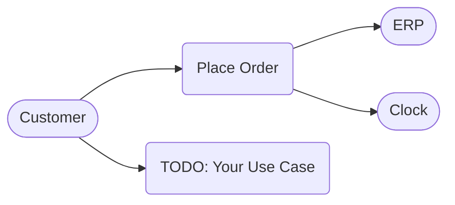

# Shop — Use Cases

```mermaid
graph LR
    Customer([Customer])
    ERP([ERP])
    Clock([Clock])

    Customer --> PlaceOrder(Place Order)
    Customer --> UC2(TODO: Your Use Case)

    PlaceOrder --> ERP
    PlaceOrder --> Clock
```
